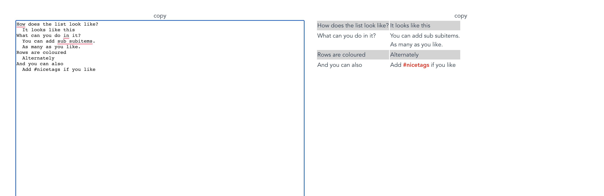

# TabList

TabList is my little helper tool to quickly build hierarchial lists that I can later copy to spreadsheets to render them more nicely.

Working with tabbed lists in a text editor is just sooo much faster than messing around with grids and columns. However, for presententation, tables rock.

So this tool allows writing in tabbed lists, annotating easily, then copying that over to spreasheets.

Enjoy.

## Running

It's Vue+Vite `npm run dev`